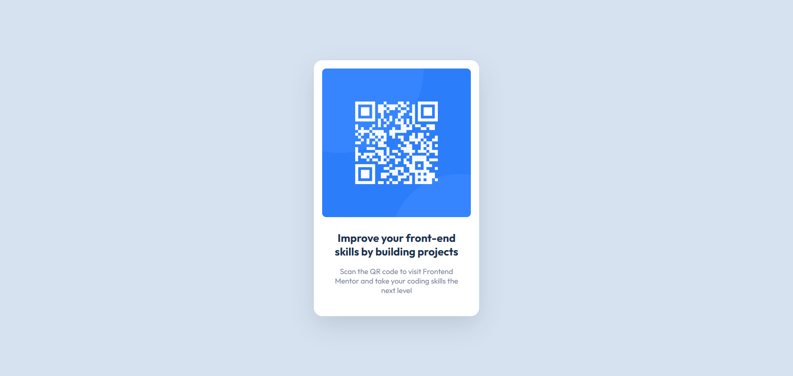

# QR Code Component

A simple QR code card component from Frontend Mentor. Built with semantic HTML5, CSS Flexbox, and responsive design principles.

## Tech Stack

HTML5 • CSS3 • Flexbox • Responsive Design

## Author

**Ferry Hasan** - [@killflex](https://frontendmentor.io/profile/killflex)
